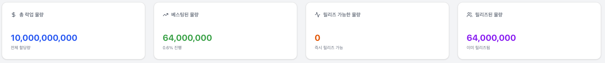
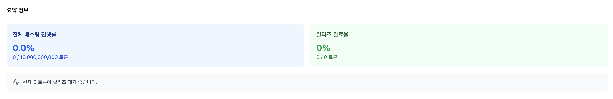
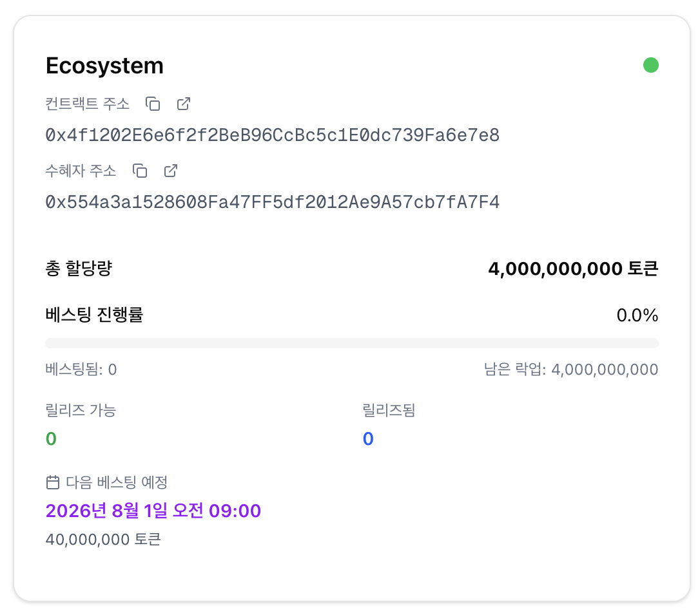
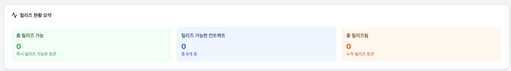
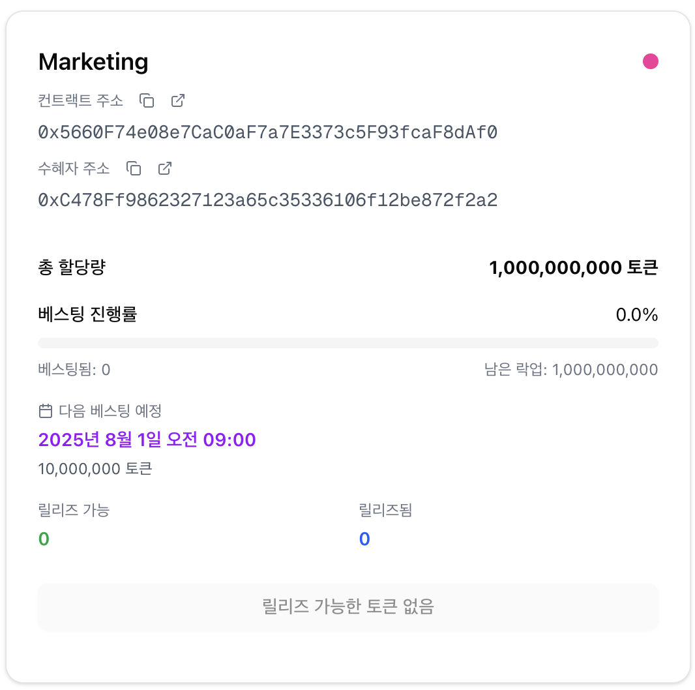
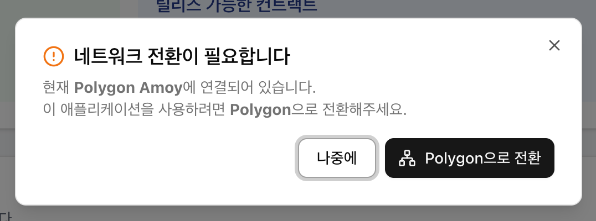
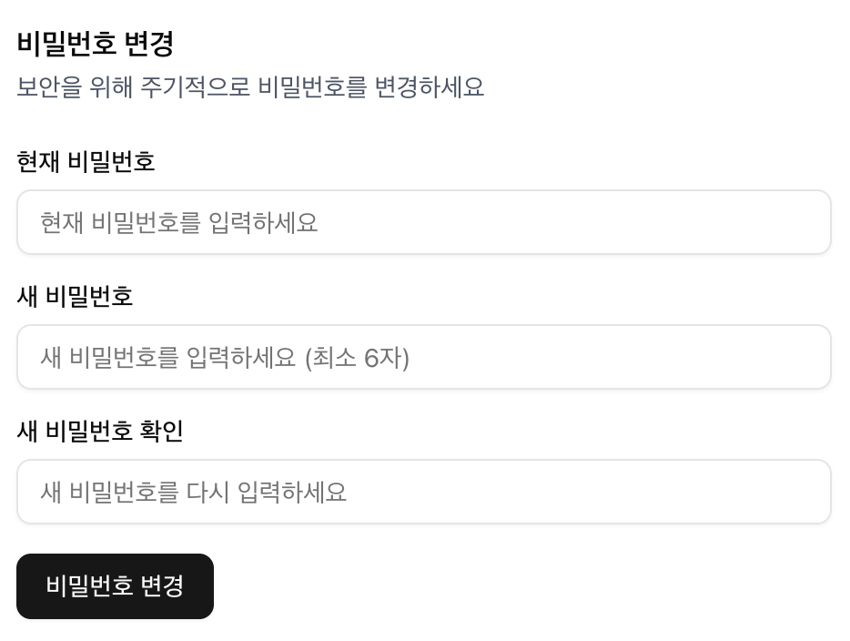

# STAU Lockup Management System

STAU 토큰의 베스팅 및 락업 관리를 위한 관리자 대시보드입니다.

Polygon 네트워크의 스마트 컨트랙트와 연동하여 실시간 베스팅 현황을 모니터링하고 토큰 릴리즈를 관리합니다.

## 기술 스택

- **Frontend**: Next.js 15, TypeScript, Tailwind CSS
- **UI Components**: shadcn/ui, Radix UI
- **Web3**: wagmi v2, viem v2, MetaMask 연동
- **Blockchain**: Polygon (Mainnet/Amoy Testnet)
- **Database**: vercel kv
- **Authentication**: 커스텀 인증 시스템

## 설정 방법

### 1. 환경 변수 설정

`.env.local` 파일을 생성하고 다음 내용을 추가하세요:

````env
# Vercel Upstash Redis Configuration
KV_REST_API_URL=
KV_REST_API_TOKEN=
KV_REST_API_READ_ONLY_TOKEN=
KV_URL=

# Blockchain Configuration
NEXT_PUBLIC_NETWORK=testnet | mainnet

# 베스팅 컨트랙트 주소들 (Polygon 네트워크)
NEXT_PUBLIC_VESTING_TOKEN_ADDRESS=
NEXT_PUBLIC_VESTING_MANAGER_ADDRESS=
NEXT_PUBLIC_VESTING_ECOSYSTEM_ADDRESS=
NEXT_PUBLIC_VESTING_FOUNDATION_ADDRESS=
NEXT_PUBLIC_VESTING_PRIVATE_INVESTOR_ADDRESS=
NEXT_PUBLIC_VESTING_TEAM_ADDRESS=
NEXT_PUBLIC_VESTING_MARKETING_ADDRESS=
NEXT_PUBLIC_VESTING_ADVISOR_ADDRESS=

### 2. 종속성 설치 및 실행

```bash
# 종속성 설치
npm install

# 개발 서버 실행
npm run dev
````

## 주요 기능

- 📊 **대시보드**: STAU 토큰 베스팅 현황 및 전체 통계 확인
- 🔐 **토큰 릴리즈**: 베스팅 일정에 도달한 토큰의 개별 릴리즈 관리
- 📈 **베스팅 모니터링**: 6개 베스팅 컨트랙트별 상세 진행 상황 추적
- 💼 **월렛 연결**: MetaMask 지갑 연결 및 Polygon 네트워크 관리
- ⚙️ **설정**: 시스템 설정 및 관리자 계정 관리

## 프로젝트 구조

```
src/
├── app/                 # Next.js App Router 페이지
│   ├── api/            # API 라우트 (인증 등)
│   ├── login/          # 로그인 페이지
│   ├── settings/       # 설정 페이지
│   ├── token/          # 토큰 릴리즈 페이지
│   ├── layout.tsx      # 루트 레이아웃
│   └── page.tsx        # 메인 대시보드
├── components/         # 재사용 가능한 컴포넌트
│   ├── admin/          # 어드민 레이아웃 및 사이드바
│   ├── auth/           # 인증 관련 컴포넌트
│   ├── ui/             # shadcn/ui 컴포넌트
│   ├── vesting/        # 베스팅 관련 컴포넌트
│   └── web3/           # 지갑 연결 및 Web3 컴포넌트
├── entities/           # TypeORM 엔티티
├── hooks/              # 커스텀 훅 (베스팅 데이터 등)
├── lib/                # 유틸리티 함수 및 설정
│   ├── abi/            # 스마트 컨트랙트 ABI
│   ├── auth.ts         # 인증 로직
│   ├── db.ts           # 데이터베이스 설정
│   └── web3-config.ts  # Web3 및 컨트랙트 설정
└── migrations/         # 데이터베이스 마이그레이션
```

# 어드민 기능 설명

## 용어정리

- 락업 컨트랙트: 블록체인상에 락업 로직이 구현되어 있는 일종의 계약 지갑
- 수혜자: 락업 해제된 토큰을 수령하는 지갑

- 락업: 락업 컨트랙트에 묶여 있는 것
- 베스팅: 락업 해제 시점이 도래한 것
- 릴리즈: 베스팅된 토큰을 수혜자에게 전달하는 것

## 대시보드

### Summary 정보




- 총 락업 물량: 전체 락업 물량 (10B 고정)
- 베스팅된 물량: 현재 시점 락업 해제 스케쥴에 도달한 전체 물량
- 릴리즈 가능한 물량: 베스팅 된 물량 중 아직 릴리즈 되지 않은 물량
- 릴리즈된 물량: 릴리즈가 완료된 물량
- 전체 베스팅 진행률: 전체 락업 물량에 대해 베스팅 완료 비율
- 릴리즈 완료율: 현재 베스팅 완료된 물량에 대해 릴리즈 완료 비율

### 컨트랙트별 현황



- 컨트랙트 주소, 수혜자 주소 표시 (copy 및 explorer 링크 버튼)
- 총 할당량: 해당 컨트랙트의 총 락업 물량
- 락업 해제 현황을 progress 형태로 제공
- 베스팅된 물량, 릴리즈된 물량, 릴리즈가능 물량 표시
- 다음 베스팅 일정 및 베스팅 물량 안내

## 토큰 릴리즈





- 릴리즈 현황 요약 제공
- Web3 지갑을 연결하여 릴리즈 수행 가능 (MetaMask 추천)
- 폴리곤 네트워크로 연결되어 있지 않을 경우 안내 모달 노출 및 원버튼 네트워크 변경 지원
- 지갑 익스텐션이 설치되어 있지 않을 경우 에러 발생
- 토큰 릴리즈 버튼 클릭 시 연결되어 있는 Web3 지갑 호출 -> 소량의 Pol을 수수료로 사용하여 릴리즈함수 호출

## 설정



- 비밀번호 변경 기능
